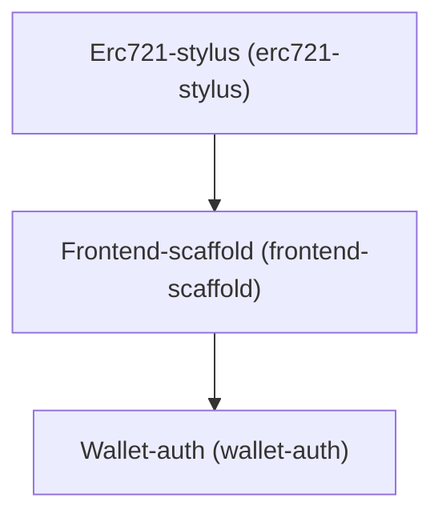

# Architecture

## Dependency Graph

```mermaid
graph TD
  aa212c89["Erc721-stylus (erc721-stylus)"]
  99a621a6["Frontend-scaffold (frontend-scaffold)"]
  a368983e["Wallet-auth (wallet-auth)"]
  aa212c89 --> 99a621a6
  99a621a6 --> a368983e
```

## Execution / Implementation Order

1. **Erc721-stylus** (`aa212c89`)
2. **Frontend-scaffold** (`99a621a6`)
3. **Wallet-auth** (`a368983e`)
